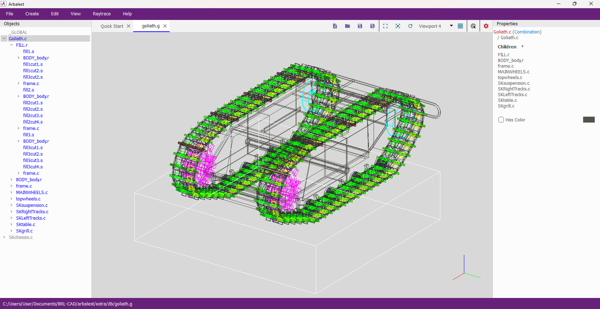
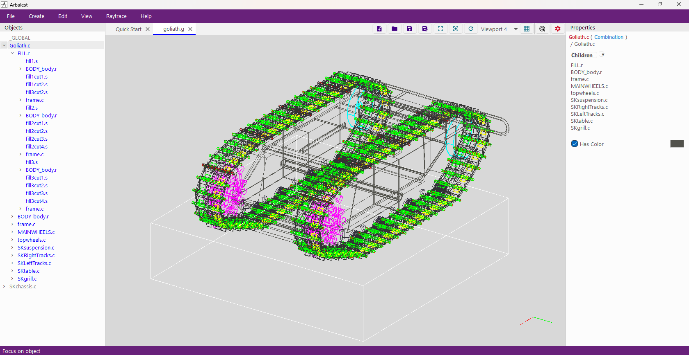
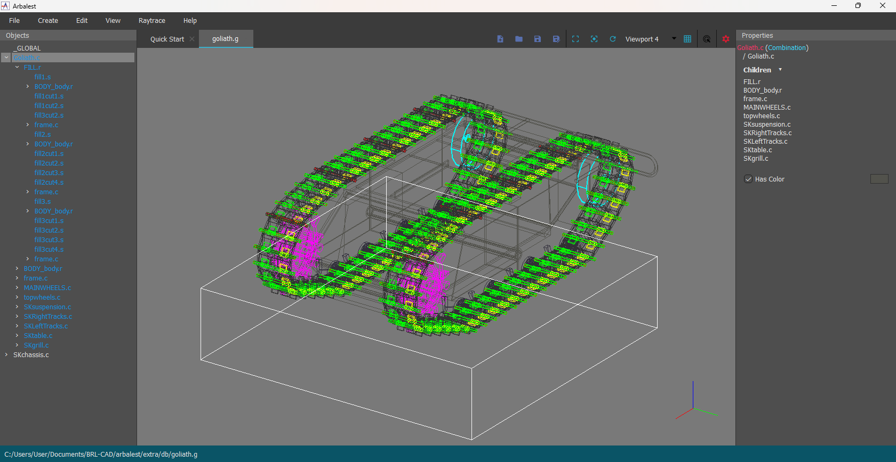
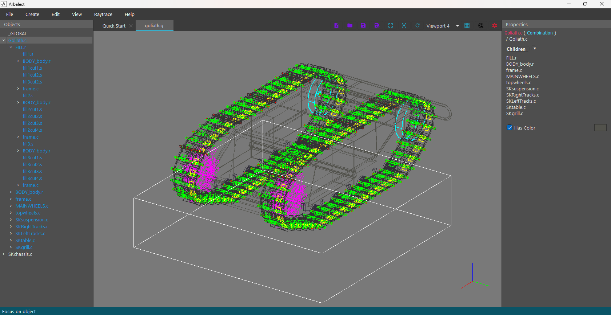

# GSoC 2025 Daily Logs

> **Tips on how to read the logs**:
>
> In the "*PRs*" section you will find all the pull requests (PRs) related to my *Google Summer of Code 2025* project. 
>
> In the "*Logs*" section instead you will find what I worked on each day. Most of the features/bugs I worked on each day are <ins>underlined</ins> and have a superscript number #n. This number is equivalent to the number of the PR in which these features/bugs that I have worked on were merged into the code. This was done to show in which PR my work went each day.

## PRs

- [PR#59](https://github.com/BRL-CAD/arbalest/pull/59) = Removed using directives in header files
- [PR#60](https://github.com/BRL-CAD/arbalest/pull/60) = Reverted the hacks done to create a personalized title bar and restored the "standard Qt" look for the title bar
- [PR#61](https://github.com/BRL-CAD/arbalest/pull/61) = Removed some superfluous `MainWindow`'s methods and icon memory waste
- [PR#62](https://github.com/BRL-CAD/arbalest/pull/62) = Standardized the `QStyleSheet` "arbalest_simple.qss" to appear the same way on Windows (Windows 11) and Linux (Ubuntu 24.04.1 LTS)
- [PR#63](https://github.com/BRL-CAD/arbalest/pull/63) = Added a dedicated method that sets UI elements icons and added more theme variables for icon colors
- [PR#64](https://github.com/BRL-CAD/arbalest/pull/64) = Added support for changing themes at runtime (without having to reopen arbalest)

## Logs

- **Community Bonding Period**:
    - *05/08 Thu*: Discovered that my project got accepted! 😊🎉
    - *05/09 Fri*: Dealt with all the GSoC-related bureaucratic stuff
    - *05/10 Sat*: Created [this repo](https://github.com/LorenzoPegorari/GSoC25-report) to share with my mentors what I am working / have worked on
    - *05/12 Mon*: Made a quick fix to <ins>revert the hacks done to create a personalized title bar and restore the "standard Qt" look</ins>#60. I tested this code only on Ubuntu 24.04.1 LTS at the moment
    - *05/13 Tue*: Started working on prototyping a basic CLI in order to try to identify possible issues that could arise (so that I can discuss them with the mentors before the Coding Period starts)
    - *05/14 Wed*: Participated in the "*Welcome 2025 Contributor talk and Q&A*" by the GSoC team
    - *05/15 Thu*: Kept working on the CLI prototype
    - *05/19 Mon*: Tried to build and compile brlcad, MOOSE and arbalest on Windows 11, but without any luck (for some reason arbalest cannot execute properly because it does not find `Qt6OpenGLWidgets`). Although, I spotted a bug that can be easily solved: when compiling arbalest, I got the error `rpcndr.h: 'byte': ambiguous symbol` (this is a [known issue with Windows headers](https://developercommunity.visualstudio.com/t/93889)). To fix it, I simply <ins>removed the `using namespace std;` in `Utils.h`, and I then changed all the few instances where this statement was meaningful by manually adding `std::`</ins>#59
    - *05/20 Tue*: A storm caused a problem with my Internet Service Provider in my local area, so I didn't have Internet. Anyway, I kept trying to build arbalest on Windows 11, but with no success unfortunately
    - *05/21 Wed*: Still no Internet. I kept working on the CLI prototype
    - *05/22 Thu*: Internet got fixed finally. Also I kept working on the CLI prototype, particularly exploring how to use the already created `QgConsole` (in `libqtcad`)
    - *05/23 Fri*: Kept working on the CLI prototype and exploring `libqtcad`
    - *05/25 Sun*: Started working on the <ins>new theme creator feature</ins>x, focusing on how to make it so that themes can be changed at runtime (without closing and reopening the application)
    - *05/26 Mon*: Kept working on the <ins>new theme creator feature</ins>x
    - *05/27 Tue*: Found a way to make it so that <ins>themes can change at runtime without restarting the application</ins>#64. I need to make it sure that it works correctly in all possible cases
    - *05/29 Thu*: Worked on the <ins>CLI prototype</ins>?, focusing on the best way to bridge or reuse qtcad’s Qt Widgets without breaching arbalest’s clean and easy-to-scale implementation
    - *06/01 Sun*: Video chat with BRL-CAD's old and new GSoC contributors and mentors before the *Coding Period* officially begins
- **Coding Period (1st half)**:
    - Week 1:
        - *06/02 Mon*: Prepared [PR#59](https://github.com/BRL-CAD/arbalest/pull/59) and [PR#60](https://github.com/BRL-CAD/arbalest/pull/60) that I will do after I can test them on Windows 11. Kept trying to build arbalest on Windows 11
        - *06/03 Tue*: Worked on <ins>fixing how arbalest themes appear on Linux</ins>#62. Kept trying to build arbalest on Windows 11
        - *06/04 Wed*: Finally built arbalest on Windows 11! Tested and opened [PR#59](https://github.com/BRL-CAD/arbalest/pull/59). Tested [PR#60](https://github.com/BRL-CAD/arbalest/pull/60) on Windows 11 
        - *06/05 Thu*: Participated in the "*Special Q&A session regarding the Coding Period*" by the GSoC team. Opened [PR#60](https://github.com/BRL-CAD/arbalest/pull/60)
        - *06/06 Fri*: Worked on <ins>standardizing how themes look on Linux and Windows 11</ins>#62
        - *06/07 Sat*: **[PR#59](https://github.com/BRL-CAD/arbalest/pull/59) and [PR#60](https://github.com/BRL-CAD/arbalest/pull/60) got merged!**
    - Week 2:
        - *06/09 Mon*: Worked on <ins>standardizing how themes look on Linux and Windows 11</ins>#61,#62
        - *06/11 Wed*: Finished <ins>standardizing how themes look on Linux and Windows 11</ins>#62,#63
        - *06/12 Thu*: Worked on a few bugs related to <ins>how themes look on Linux and Windows 11</ins>#61,#62#,#63,#64 (e.g: icons colors, refreshing icons at runtime, refreshing properties at runtime, refreshing viewports background colors at runtime, ...)
        - *06/13 Fri*: Fully implemented support for <ins>changing themes at runtime</ins>#64!
        - *06/14 Sat*: Ironed out the new <ins>style and themes</ins>#62 and the new feature for <ins>changing themes at runtime</ins>#64
        - *06/15 Sun*: Opened [PR#61](https://github.com/BRL-CAD/arbalest/pull/61), [PR#62](https://github.com/BRL-CAD/arbalest/pull/62) and [PR#63](https://github.com/BRL-CAD/arbalest/pull/63). **[PR#61](https://github.com/BRL-CAD/arbalest/pull/61) got merged!**
    - Week 3:
        - *06/16 Mon*: Opened [PR#64](https://github.com/BRL-CAD/arbalest/pull/64). **[PR#62](https://github.com/BRL-CAD/arbalest/pull/62) and [PR#63](https://github.com/BRL-CAD/arbalest/pull/63) got merged!**
        - *06/17 Tue*: **[PR#64](https://github.com/BRL-CAD/arbalest/pull/64) got merged!**
        - *06/19 Thu*: Started working again on the <ins>CLI prototype</ins>x. The first goal is to find the best way to use MOOSE to connect arbalest and `libqtcad`
        - *06/22 Sun*: Tried building a <ins>MOOSE module that will act as a C++ layer for `libqtcad`</ins>x
    - Week 4:
        - *06/23 Mon*: Kept exploring the best way to have a <ins>MOOSE module that will act as a C++ layer for `libqtcad`</ins>x
        - *06/24 Tue*: Worked on the <ins>new CLI, focusing especially on the `QWidget` side of the CLI</ins>?
        - *06/26 Thu*: Studied how `libqtcad` is implemented as deeply as possible, in order to understand how it can be connect with MOOSE and arbalest
        - *06/28 Sat*: Kept studing how the `libqtcad` library works, focusing on understanding if it is possible to use its contents for arbalest
    - Week 5:
        - *06/30 Mon*: After more testing, and after confronting my mentors, I came to the conclusion that there is no way to connect the `libqtcad` library to MOOSE. This is because there is no way to connect them while preserving the main idea behind MOOSE, that is to be "a thin layer on top of BRL-CAD's core libraries". Maybe directly accessing the `libqtcad` library from arbalest could be a good temporary solution?
        - *07/01 Tue*: Explored a way to <ins>improve the current `ObjectTree` class</ins>?, which handles the creation of a tree data structure that represents the opened database. The `ObjectTree` needs to be improved to support the GED commands that the new CLI will execute
        - *07/03 Thu*: Finalized a <ins>plan for how to insert a functioning CLI inside of arbalest, that can handle 99% of the GED commands</ins>? (MOOSE will handle the execution of commands, while the `QgConsole` defined inside `libqtcad` will be used to create the actual `QWidget` console)
        - *07/04 Fri*: Submitted my plan to the mentors and <ins>started working on it</ins>?
        - *07/05 Sat*: Discovered, with the help of my mentors, a problem regarding how "in-memory databases" are handled by `libged` (some GED commands do not work with "in-memory databases" yet, as they are a recent addition). In the mean time, I worked on <ins>implementing the `QgConsole` (defined inside `libqtcad`) into arbalest, and got it to work</ins>x
    - Week 6:
        - *07/07 Mon*: Worked on <ins>improving the current `ObjectTree` class</ins>?. Finding a lot of issues to fix. The main one is having a way of knowing which objects in the database were added/modified/killed by a CLI command, without having to rewrite a GED parser
        - *07/08 Tue*: Showed a prototype of the CLI to my mentors, and discussed with them how to tackle the many issues that come with supporting all GED commands
- **Coding Period (2nd half)**:
    - Week 7:
    - Week 8:
        - ...
    - Week 9:
        - ...
    - Week 10:
        - ...
    - Week 11:
        - ...
    - Week 12:
        - ...
    - *Final evaluation*:
        - ...

## Resources

### Videos

**New Arbalest style and themes on Linux (Ubuntu 24.04.1 LTS)** *with theme change at runtime*:

<video controls>
  <source src="assets/arbalest-linux-new.mp4" type="video/mp4">
</video>

**Old Arbalest style and themes on Linux (Ubuntu 24.04.1 LTS)**

<video controls>
  <source src="assets/arbalest-linux-old.mp4" type="video/mp4">
</video>

### Images

**New Arbalest style and light theme on Windows (Windows 11)** *with theme change at runtime*:

**Old Arbalest style and light theme on Windows (Windows 11)**:

**New Arbalest style and dark theme on Windows (Windows 11)** *with theme change at runtime*:

**Old Arbalest style and dark theme on Windows (Windows 11)**:

